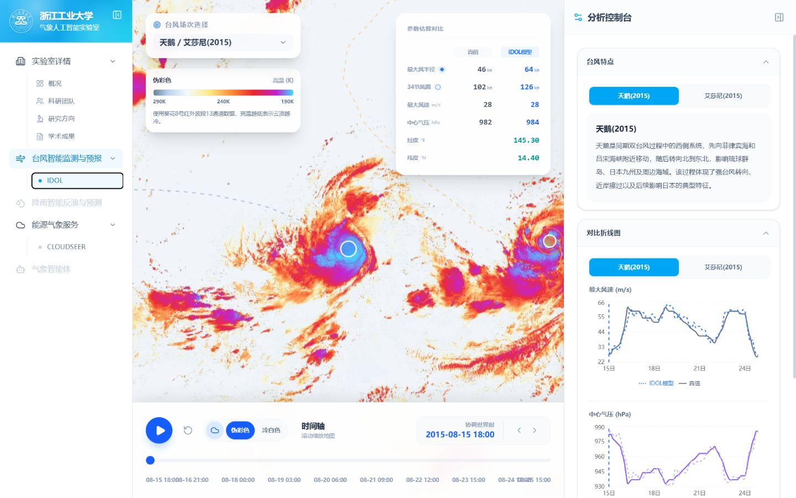
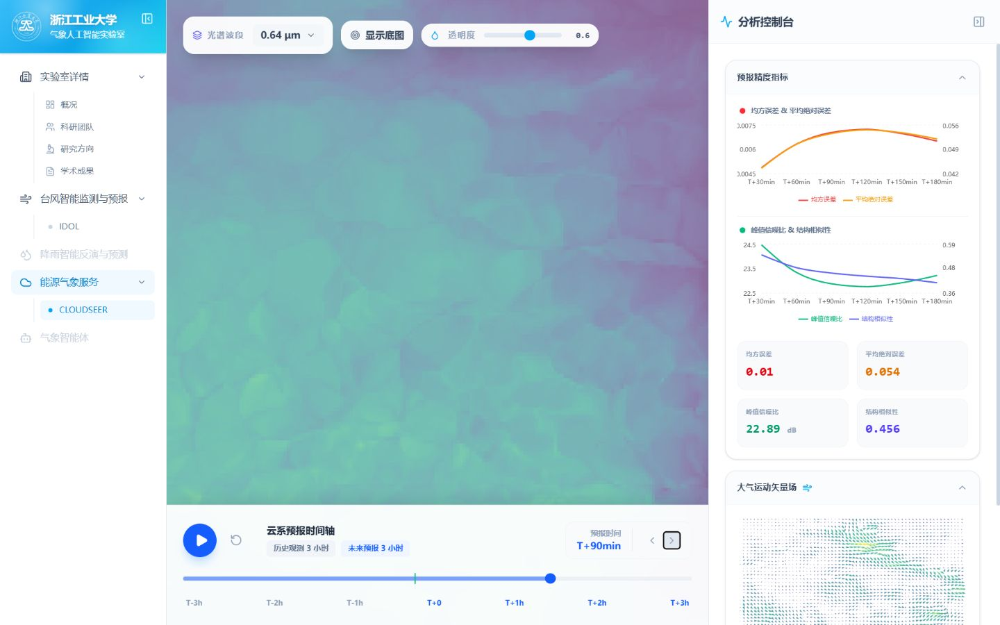

# AI Meteorology

> 浙江工业大学气象人工智能实验室科研成果展示与交互式可视化平台。

**在线体验：** [https://www.aimeteorology.cn/](https://www.aimeteorology.cn/)

## 项目简介

AI Meteorology 面向气象人工智能研究成果的展示与交互分析，汇集实验室团队、研究方向和学术成果，并提供台风智能监测与云系演变预测的可视化应用。

平台目前包含 IDOL 台风多任务估算与 CloudSeer 多光谱云系预测两个交互模块，支持时间序列播放、模型结果对比、地图叠加和指标分析。

## 界面预览

### 实验室门户


### IDOL 台风分析



### CloudSeer 云系预测



## 核心能力

- **实验室门户**：集中展示科研团队、研究方向、代表性论文与开源成果。
- **IDOL 台风分析**：结合卫星红外云图与台风轨迹，交互展示最大风速、中心气压、最大风半径和 34 节风圈半径等多任务估算结果。
- **CloudSeer 云系预测**：提供多光谱波段切换、历史观测与未来预测播放，以及误差指标和大气运动矢量场对比。

## 本地运行

请先安装 [Node.js](https://nodejs.org/) 与 npm，然后执行：

```bash
npm install
npm run dev
```

## 技术栈

React 19 · TypeScript · Vite 6 · Tailwind CSS 4 · React-Leaflet / Leaflet · Recharts · Framer Motion

## 相关研究

- **IDOL: Meeting Diverse Distribution Shifts with Prior Physics for Tropical Cyclone Multi-Task Estimation**，NeurIPS 2025： [论文](https://github.com/Zjut-MultimediaPlus/IDOL/blob/main/IDOL-Neurips-CRC.pdf) · [模型源码](https://github.com/Zjut-MultimediaPlus/IDOL)

## 使用声明

本平台用于科研成果展示与交互式分析，所呈现的模型结果不构成业务气象预报，也不能替代气象主管部门发布的正式预报、预警与防灾指引。

## 问题反馈

如果发现页面异常、数据展示问题或有功能建议，请通过 [GitHub Issues](https://github.com/zpf6tw/TyphoonMonitor/issues) 反馈。
